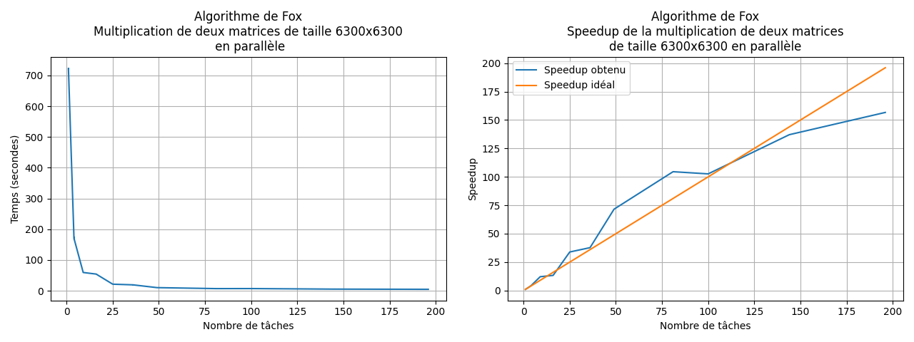

# Algorithme de Fox

L'algorithme de Fox permet de multiplier en parallèle deux matrices carrées de même taille.

## Compiler le projet

* Clonez le projet `git clone ssh://git@ssh.hesge.ch:10572/hpc_etu_2021/serie_6_rendu.git`
* Naviguez dans mon projet `cd coudray_baptiste`
* Chargez le module `foss` si vous êtes sur Baobab, `module load foss`
* Compilez le projet `make`
* L'exécutable `mmm.out` est disponible

## Résultats obtenus

Ces tests de performance mesurent le temps de calcul de la multiplication de deux matrices de taille 6300x6300. De plus,
le programme a été exécuté sur le *cluster* Baobab2, sur la partition `shared_cpu` et j'ai fait varier le nombre de
tâches entre 1 et 196. Le temps est moyenné sur 5 mesures de temps pour chaque nombre de tâches.

| Nombre de tâches | Moyenne [s] | Écart type [s] | Nombre de mesures | 
|---|---|---|---|
| 1   | 721.793 [s] | ± 3.365 [s] | 5 |
| 4   | 170.322 [s] | ± 4.737 [s] | 5 |
| 9   | 59.354 [s]  | ± 0.481 [s] | 5 |
| 16  | 54.186 [s]  | ± 0.793 [s] | 5 |
| 25  | 21.291 [s]  | ± 0.505 [s] | 5 |
| 36  | 19.134 [s]  | ± 2.013 [s] | 5 |
| 49  | 10.088 [s]  | ± 0.26 [s]  | 5 |
| 81  | 6.904 [s]   | ± 1.767 [s] | 5 |
| 100 | 7.033 [s]   | ± 2.155 [s] | 5 |
| 144 | 5.264 [s]   | ± 0.758 [s] | 5 |
| 196 | 4.606 [s]   | ± 0.259 [s] | 5 |

*Tableau des résultats obtenus pour l'algorithme de Fox*

*Multiplication de deux matrices de taille 6300x6300 en parallèle avec l'algorithme de Fox*

Avec ce test de performance, on remarque que la parallélisation de la multiplication de matrices permet de réduire
grandement le temps de calcul. En effet, lorsque qu'on effectue la multiplication de deux matrices de taille 6300x6300
sur une seule unité de calcul, celle-ci met environ 12 minutes, et, plus on augmente le nombre d'unités de calcul moins
il faut de temps pour calculer le résultat de la multiplication. Ainsi, avec 196 unités de calcul, l'algorithme de Fox
met environ cinq secondes pour obtenir le résultat. Finalement, on obtient un *speedup* de 157 par rapport à la version
à une seule tâche.

On remarque que le speedup obtenu entre 36 noeuds et 100 noeuds est supérieur que le supérieur idéal, cela peut
s'expliquer par le fait que les sous-matrices sont mis en cache dans le CPU ce qui permet d'améliorer les performances.
À l'inverse, quand le speedup obtenu est moins bien que le speedup idéal, il se peut que lorsque qu'on demande des
ressources au cluster, celui-ci nous attribue des CPUs avec des performances mixtes et/ou le réseau commence à saturer.

## Auteur

* Baptiste Coudray

## Ressources

* https://www.rookiehpc.com/mpi/docs/mpi_type_create_subarray.php
* https://www.rookiehpc.com/mpi/docs/mpi_cart_sub.php
* https://www.rookiehpc.com/mpi/docs/mpi_sendrecv_replace.php
